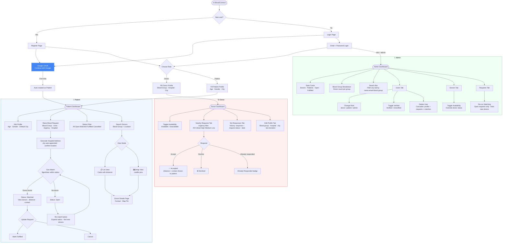

# 🩸 BloodConnect

**BloodConnect** is a community-driven, location-based **Blood/Plasma Donor Finder**
web application. It connects patients in urgent need of blood with verified, nearby,
available donors — using real-time geolocation matching, a searchable donor map, and
role-based dashboards for donors, patients, and admins.

Built as a full **MERN-stack** application: MongoDB, Express, React, Node.js — with
**Passport.js (JWT + Google OAuth)** authentication, **Leaflet/OpenStreetMap** for maps,
and a full **Admin dashboard** for platform management.

---

## Table of Contents

- [Problem Statement](#problem-statement)
- [Key Features](#key-features)
- [Platform Flow](#platform-flow)
- [Tech Stack](#tech-stack)
- [Project Structure](#project-structure)
- [Database Design (MongoDB)](#database-design-mongodb)
- [API Reference](#api-reference)
- [Geo-Matching Logic](#geo-matching-logic)
- [Getting Started](#getting-started)
- [Environment Variables](#environment-variables)
- [Default Admin Account](#default-admin-account)
- [Application Walkthrough](#application-walkthrough)
- [Roadmap / Stretch Goals](#roadmap--stretch-goals)
- [Interview Prep](#interview-prep)

---

## Problem Statement

Patients often face delays finding suitable blood/plasma donors during emergencies.
Existing methods — social media posts, phone calls, manual searching — are slow and
unreliable. **BloodConnect** solves this by letting:

- **Donors** register their blood group, availability, and a trusted location
  (hospital/blood bank — never a home address).
- **Patients** search for donors by blood group and location, or raise an urgent
  request that automatically finds and notifies nearby compatible donors.
- **Admins** manage all users, donor availability, and requests from a central dashboard.

---

## Key Features

### For Donors
- Register with blood group, hospital/blood bank location (auto-geocoded from address)
- Toggle availability (`Available` / `Not Available`) directly from the dashboard header
- **Nearby Requests tab** — view blood requests within 25 km, filtered by urgency (All / Critical / High / Medium / Low)
- "Already Responded" badge on requests already acted on; Accept / Decline buttons for new ones
- **My Responses tab** — full response history: each match with your response badge, request status badge, distance, and response date
- **Edit Profile tab** — update blood group, hospital/bank, address, city, state, pincode, last donation date (re-geocodes location on save)

### For Patients
- Register with email/password **or sign in with Google** (one click, creates patient account automatically)
- Profile details: age, gender, default city — editable any time via collapsible Edit Profile section
- Search donors by blood group + location, in **list** or **interactive map** view
- Raise an urgent blood request (blood group, units needed, urgency level, hospital)
- Hospital name auto-appended with default city to prevent wrong-city geocoding
- Confirm geocoded location before submitting (prevents ambiguous results)
- Automatically matched with nearby available donors via geospatial query
- **Status filter tabs** on My Requests: All / Open / Matched / Fulfilled / Cancelled
- **Re-match button** on open requests — re-runs geo matching with 30 km radius to find new donors
- Track request status (`open` → `matched` → `fulfilled` / `cancelled`)
- View matched donor details with distance, contact, response status, and "View on Map"

### For Admins
- Dedicated **Admin Dashboard** with stats cards, blood-group breakdown, and 3 tabs
- **Stats row**: Total Donors, Total Patients, Open Requests, Fulfilled — from live aggregation
- **Blood Group breakdown** — donor count per blood group across the platform
- **Search bar** in every tab (name, email, blood group, hospital — client-side instant filter)
- **Users tab**: all users with role dropdown (change inline), Verified/Unverified toggle, join date, delete
- **Donors tab**: blood group badge, hospital, city, availability toggle
- **Requests tab**: patient name+email, blood group, urgency badge, status badge, **Re-run Matching** button on open requests
- Delete any user and cascade-delete all their associated data (profile + requests + matches)

### Platform
- JWT-based authentication with role-based access control (donor / patient / admin)
- **Google OAuth 2.0** sign-in / sign-up (one click, no password needed)
- Passwords hashed with bcrypt
- MongoDB `2dsphere` geospatial indexes for fast "donors near me" queries
- Leaflet + OpenStreetMap for maps (no API key required)
- Free geocoding via OpenStreetMap Nominatim (India-scoped, with city disambiguation)

---

## Platform Flow

> What each role can do — from registration to final action.



---

## Tech Stack

| Layer        | Technology                                                        |
|--------------|-------------------------------------------------------------------|
| Frontend     | React 19 (Vite), React Router, Tailwind CSS v4, Leaflet/react-leaflet |
| Backend      | Node.js, Express 5                                                |
| Database     | MongoDB + Mongoose (geospatial `2dsphere` indexes)                |
| Auth         | Passport.js (Local + JWT + Google OAuth 2.0), bcrypt, jsonwebtoken |
| Maps/Geocode | Leaflet, OpenStreetMap tiles, Nominatim geocoding API (free)      |

---

## Project Structure

```
BloodConnect/
├── client/                         # React frontend (Vite)
│   ├── src/
│   │   ├── api/
│   │   │   ├── axios.js            # Axios instance with JWT interceptor
│   │   │   └── endpoints.js        # All API call wrappers (auth, donors, patients, requests, admin)
│   │   ├── components/
│   │   │   ├── Navbar.jsx          # Role-aware nav (Admin link for admins)
│   │   │   ├── MapView.jsx         # Leaflet map component
│   │   │   └── ProtectedRoute.jsx  # JWT guard + role guard
│   │   ├── context/
│   │   │   └── AuthContext.jsx     # Auth state: login / register / loginWithToken / logout
│   │   ├── pages/
│   │   │   ├── Home.jsx
│   │   │   ├── Login.jsx           # Email/password + Google OAuth button
│   │   │   ├── Register.jsx        # Role selector + Google OAuth button (patient)
│   │   │   ├── OAuthCallback.jsx   # Handles ?token= redirect after Google auth
│   │   │   ├── Dashboard.jsx       # Routes to Donor/Patient/Admin dashboard by role
│   │   │   ├── AdminDashboard.jsx  # Stats cards · search · Users · Donors · Requests tabs
│   │   │   ├── DonorDashboard.jsx  # Nearby Requests · My Responses · Edit Profile tabs
│   │   │   ├── PatientDashboard.jsx# Edit Profile · Create Request · My Requests (status filter + re-match)
│   │   │   ├── DonorList.jsx       # Search donors (list/map)
│   │   │   ├── DonorDetails.jsx    # Donor profile + map pin
│   │   │   └── RequestDetails.jsx  # Request + matched donors
│   │   └── utils/
│   │       └── geocode.js          # Address → {coordinates, displayName} via Nominatim (India-scoped)
│   └── vite.config.js              # Tailwind plugin + /api proxy to backend
│
├── server/                         # Express REST API
│   ├── config/
│   │   ├── db.js                   # MongoDB connection
│   │   └── passport.js             # Local + JWT + Google OAuth strategies
│   ├── models/
│   │   ├── User.js                 # googleId field + optional password/phone for OAuth users
│   │   ├── Donor.js
│   │   ├── Patient.js
│   │   ├── Request.js
│   │   └── Match.js
│   ├── controllers/
│   │   ├── auth.controller.js      # register · login · getMe · googleCallback
│   │   ├── admin.controller.js     # getStats · CRUD users/donors/requests · adminRematch · toggleVerified
│   │   ├── donor.controller.js     # getMyProfile · getMyResponses · updateMyProfile · getNearbyRequests
│   │   ├── patient.controller.js
│   │   └── request.controller.js   # createRequest · getMyRequests · rematchRequest · respondToMatch
│   ├── routes/
│   │   ├── auth.routes.js          # /register · /login · /me · /google · /google/callback
│   │   ├── admin.routes.js         # All routes protected: protect + authorize("admin")
│   │   ├── donor.routes.js         # /me · /me/responses · /me/availability · /requests/nearby
│   │   ├── patient.routes.js
│   │   └── request.routes.js       # POST /:id/rematch · POST /:id/respond
│   ├── middleware/
│   │   ├── auth.js                 # protect (JWT) + authorize (RBAC)
│   │   └── errorHandler.js
│   ├── services/
│   │   └── matching.service.js     # $geoNear donor matching
│   ├── utils/
│   │   └── generateToken.js
│   └── server.js                   # App entrypoint
│
├── RUNNING_LOCALLY.md              # Step-by-step VS Code setup guide
├── INTERVIEW_PREP.md               # Backend/DB interview Q&A for this project
└── README.md
```

---

## Database Design (MongoDB)

Five collections, connected via `userId` / `patientId` / `donorId` / `requestId`
references:

### `users`
Shared identity for all roles.
```js
{
  _id, name, email (unique), password (hashed, select:false, optional for Google users),
  phone (optional for Google users), googleId (sparse index),
  role: "donor" | "patient" | "admin",
  isVerified, otp: { code, expiresAt },
  createdAt, updatedAt
}
```

### `donors`
```js
{
  _id, userId (ref User, unique),
  bloodGroup: "A+" | "A-" | "B+" | "B-" | "O+" | "O-" | "AB+" | "AB-",
  isAvailable: Boolean,
  lastDonationDate,
  location: { type: "Point", coordinates: [lng, lat] },  // 2dsphere indexed
  hospitalOrBank, address, city, state, pincode
}
```
Indexes: `{ location: "2dsphere" }`, `{ bloodGroup: 1, isAvailable: 1 }`

### `patients`
```js
{
  _id, userId (ref User, unique),
  age, gender, defaultCity
}
```

### `requests`
```js
{
  _id, patientId (ref Patient),
  bloodGroup, unitsNeeded, urgency: "low"|"medium"|"high"|"critical",
  hospitalName, description,
  location: { type: "Point", coordinates: [lng, lat] },  // 2dsphere indexed
  status: "open" | "matched" | "fulfilled" | "expired" | "cancelled",
  expiresAt
}
```
Indexes: `{ location: "2dsphere" }`, `{ status: 1, bloodGroup: 1 }`

### `matches`
```js
{
  _id, requestId (ref Request), donorId (ref Donor),
  distanceKm, notifiedAt,
  donorResponse: "pending" | "accepted" | "declined",
  respondedAt
}
```
Index: unique compound `{ requestId: 1, donorId: 1 }` — prevents duplicate matches.

---

## API Reference

Base URL: `/api`

### Auth (`/api/auth`)
| Method | Endpoint              | Auth | Description |
|--------|-----------------------|------|-------------|
| POST   | `/register`           | —    | Register as donor or patient |
| POST   | `/login`              | —    | Login with email + password, returns JWT |
| GET    | `/me`                 | JWT  | Get current user |
| GET    | `/google`             | —    | Redirect to Google OAuth consent screen |
| GET    | `/google/callback`    | —    | Google OAuth callback → redirects to frontend with JWT |

### Donors (`/api/donors`)
| Method | Endpoint                  | Auth          | Description |
|--------|---------------------------|---------------|-------------|
| GET    | `/`                       | —             | Search/filter donors: `?bloodGroup=O+&lat=&lng=&radiusKm=&available=true` |
| GET    | `/:id`                    | —             | Donor details |
| PATCH  | `/me/availability`        | JWT (donor)   | Toggle `isAvailable` |
| PATCH  | `/me`                     | JWT (donor)   | Update donor profile/location |
| GET    | `/me`                     | JWT (donor)   | Own donor profile |
| GET    | `/me/responses`           | JWT (donor)   | Response history (all matches for this donor) |
| GET    | `/requests/nearby`        | JWT (donor)   | Blood requests near this donor |

### Patients (`/api/patients`)
| Method | Endpoint | Auth           | Description |
|--------|----------|----------------|-------------|
| GET    | `/me`    | JWT (patient)  | Get own profile |
| PATCH  | `/me`    | JWT (patient)  | Update profile (age, gender, city) |

### Requests (`/api/requests`)
| Method | Endpoint            | Auth          | Description |
|--------|---------------------|---------------|-------------|
| POST   | `/`                 | JWT (patient) | Create a blood request → triggers geo-matching |
| GET    | `/me`               | JWT (patient) | List own requests |
| GET    | `/:id`              | JWT           | Request details + matched donors |
| PATCH  | `/:id/status`       | JWT (patient) | Update status (`fulfilled`/`cancelled`) |
| POST   | `/:id/respond`      | JWT (donor)   | Accept/decline a match |
| POST   | `/:id/rematch`      | JWT (patient) | Re-run geo matching on an open request |

### Admin (`/api/admin`) — JWT + admin role required
| Method | Endpoint                       | Description |
|--------|--------------------------------|-------------|
| GET    | `/stats`                       | Live aggregation: users by role, requests by status, donors by blood group |
| GET    | `/users`                       | List all users |
| GET    | `/donors`                      | List all donor profiles |
| GET    | `/patients`                    | List all patient profiles |
| GET    | `/requests`                    | List all blood requests |
| PATCH  | `/users/:id/role`              | Change a user's role |
| PATCH  | `/users/:id/verify`            | Toggle user's `isVerified` flag |
| PATCH  | `/donors/:id/availability`     | Toggle donor availability |
| POST   | `/requests/:id/rematch`        | Re-run geo matching on an open request |
| DELETE | `/users/:id`                   | Delete user + cascade all associated data |

---

## Geo-Matching Logic

When a patient creates a request, `services/matching.service.js` runs:

```js
Donor.aggregate([
  { $geoNear: {
      near: request.location,
      distanceField: "distanceMeters",
      maxDistance: radiusKm * 1000,
      spherical: true,
      query: { bloodGroup: request.bloodGroup, isAvailable: true }
  }},
  { $limit: 20 }
]);
```

Matching donors are upserted into the `matches` collection (idempotent via the unique
`{requestId, donorId}` index), and the request status flips to `matched` if any donors
are found.

**Geocoding disambiguation:** when a patient types a hospital name without a city (e.g.
`"Apollo Hospital"`), the frontend automatically appends their `defaultCity` before
geocoding (`"Apollo Hospital, Hyderabad"`) and shows the resolved full address for
confirmation — preventing wrong-city matches.

---

## Getting Started

> See [RUNNING_LOCALLY.md](RUNNING_LOCALLY.md) for the full step-by-step VS Code guide.

### Prerequisites
- Node.js v18+
- MongoDB running locally (`brew services start mongodb-community`) or a MongoDB Atlas URI

### 1. Backend
```bash
cd server
npm install
npm run dev      # http://localhost:5000
```

### 2. Frontend
```bash
cd client
npm install
npm run dev      # http://localhost:5173
```

The Vite dev server proxies all `/api/*` requests to `http://localhost:5000`
(see `client/vite.config.js`), so no CORS configuration is needed in development.

---

## Environment Variables

`server/.env`:

```env
PORT=5000
MONGO_URI=mongodb://127.0.0.1:27017/bloodconnect
JWT_SECRET=replace_with_a_long_random_string
JWT_EXPIRES=7d
CLIENT_ORIGIN=http://localhost:5173

# Google OAuth — get these from console.cloud.google.com
GOOGLE_CLIENT_ID=your_google_client_id
GOOGLE_CLIENT_SECRET=your_google_client_secret
GOOGLE_CALLBACK_URL=http://localhost:5000/api/auth/google/callback
```

**Setting up Google OAuth:**
1. Go to [Google Cloud Console](https://console.cloud.google.com/) → APIs & Services → Credentials
2. Create an **OAuth 2.0 Client ID** (Web application)
3. Add `http://localhost:5000/api/auth/google/callback` to **Authorized redirect URIs**
4. Copy the Client ID and Secret into `server/.env`

> ⚠️ `.env` is gitignored — never commit real secrets.

---

## Default Admin Account

A seed admin account is included for local development:

| Field    | Value                      |
|----------|----------------------------|
| Email    | `admin@bloodconnect.app`   |
| Password | `admin@123`                |
| Role     | `admin`                    |

To create it in your local MongoDB:
```bash
cd server
node -e "
require('dotenv').config();
const mongoose = require('mongoose');
const bcrypt = require('bcryptjs');
(async () => {
  await mongoose.connect(process.env.MONGO_URI);
  const User = require('./models/User');
  const hash = await bcrypt.hash('admin@123', 10);
  await User.collection.insertOne({
    name: 'Admin', email: 'admin@bloodconnect.app',
    password: hash, phone: '0000000000',
    role: 'admin', isVerified: true,
    createdAt: new Date(), updatedAt: new Date()
  });
  console.log('Admin created');
  await mongoose.disconnect();
})();
"
```

---

## Application Walkthrough

1. **Register** as a Donor (blood group + hospital address — auto-geocoded) or as a
   Patient (age, gender, city) — or click **Continue with Google** for a one-click
   patient account.
2. **Donors** land on a three-tab dashboard:
   - **Nearby Requests** — filter by urgency, see "Already Responded" badge, accept or decline
   - **My Responses** — full history of every match with response badge and request status
   - **Edit Profile** — update blood group, location, last donation date
3. **Patients** land on their dashboard:
   - **Edit Profile** (collapsible) — update age, gender, default city
   - **Raise a Blood Request** — hospital is geocoded (city auto-appended), resolved address confirmed before submit; backend runs `$geoNear` and reports match count
   - **My Requests** — filter by status (All / Open / Matched / Fulfilled / Cancelled), re-match open requests, mark fulfilled or cancel
4. From **My Requests**, patients open **Request Details** to see matched donors, their distance, contact info, and response status (pending/accepted/declined), plus a **"View on Map"** link.
5. Anyone (logged in or not) can use **Find Donors** to search by blood group and location, switching between card **list view** and interactive **Leaflet map**.
6. **Admins** log in to the **Admin Dashboard**:
   - Stats cards and blood-group breakdown at the top
   - Search bar filtering any tab instantly
   - Change user roles, toggle verified status, delete users with cascade
   - Toggle donor availability, re-run matching on open requests

---

## Roadmap / Stretch Goals

- [ ] OTP verification on registration (Twilio Verify)
- [ ] SMS / Email notifications to matched donors (Twilio + Nodemailer)
- [ ] Push notifications (Firebase)
- [x] Admin role + moderation dashboard
- [x] Admin stats cards + blood group breakdown
- [x] Admin search, verified toggle, re-run matching
- [x] Google OAuth sign-in / sign-up
- [x] Donor — urgency filter, already-responded badge, response history tab, edit profile tab
- [x] Patient — status filter, re-match button, edit profile section
- [ ] Request expiry automation (scheduled job / TTL handling)
- [ ] Pagination on donor/request lists
- [ ] Automated tests (Jest + Supertest + mongodb-memory-server)

---

## Interview Prep

See [INTERVIEW_PREP.md](INTERVIEW_PREP.md) for a detailed Q&A covering backend
architecture, Passport/JWT authentication, MongoDB schema design, geospatial
queries (`$geoNear`, `2dsphere`), and API design decisions — all tied directly to
this codebase.

---

## Author

**Saikiran Maruri** ([@marurisaikiran](https://github.com/marurisaikiran))
